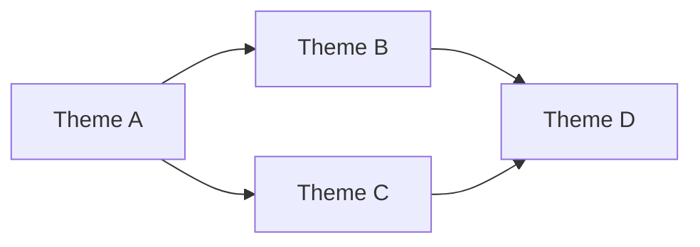

# Interactive Workflow

Use this reference for the full interactive `/groom` flow through ground,
architecture critique, research, and exploration.

## Phase 1: Context

### Step 1: Load or Update Project Context

Check for `project.md` in project root:

**If `project.md` exists:**
1. Read and display current vision/principles
2. Only update if vision, principles, philosophy, or domain language have genuinely changed
3. Never inject ephemeral data (versions, issue numbers, sprint themes) — see `project-md-format.md`

**If `project.md` doesn't exist (but `vision.md` does):**
1. Read `vision.md`
2. Migrate content into `project.md` format (see `project-md-format.md`)
3. Interview for missing sections (principles, philosophy, domain glossary, quality bar)
4. Write `project.md`, delete `vision.md`

**If neither exists:**
1. Interview: "What's your vision for this product? Where should it go?"
2. Write `project.md` using `project-md-format.md`

Store as `{project_context}` for agent context throughout session.

### Step 2: Check Tune-Repo Freshness

Verify that codebase context artifacts are current:

```bash
[ -f docs/CODEBASE_MAP.md ] && head -5 docs/CODEBASE_MAP.md || echo "No CODEBASE_MAP.md"
[ -f docs/context/INDEX.md ] && echo "Context index exists" || echo "No context index"
[ -f docs/context/ROUTING.md ] && echo "Routing table exists" || echo "No routing table"
[ -f docs/context/DRIFT-WATCHLIST.md ] && echo "Drift watchlist exists" || echo "No drift watchlist"
[ -f CLAUDE.md ] && echo "CLAUDE.md exists" || echo "No CLAUDE.md"
[ -L AGENTS.md ] && echo "AGENTS.md is symlink (good)" || { [ -f AGENTS.md ] && echo "X AGENTS.md is a regular file — should be symlink to CLAUDE.md (drift risk)" || echo "No AGENTS.md"; }
```

If stale or missing, recommend `/tune-repo`. Do not block grooming.

### Step 3: Read Implementation Retrospective

Use Glob to find `.groom/retro/**/*.md`, then Read each file.

Extract:
- effort calibration
- scope patterns
- blocker patterns
- domain gotchas

Present: "From past implementations, I see these patterns: [summary]"

### Step 3b: Load BACKLOG.md

Check for `.groom/BACKLOG.md`:

```bash
[ -f .groom/BACKLOG.md ] && echo "BACKLOG.md exists ($(wc -l < .groom/BACKLOG.md) lines)" || echo "No .groom/BACKLOG.md"
```

**If exists:** Read it. Note "High Potential" items as promotion candidates.
Present: "BACKLOG.md has N high-potential ideas and N someday/maybes. Last groomed: {date}."

**If doesn't exist:** Will create during Phase 5 synthesis if any ideas get deferred.

Store as `{backlog_md}` for use during synthesis.

### Step 4: Capture What's On Your Mind

Ask:

```text
Anything on your mind? Bugs, UX friction, missing features, nitpicks?
These become issues alongside the automated findings.

(Skip if nothing comes to mind)
```

For each item: clarify once if needed, assign tentative priority, do not create yet.

### Step 5: Quick Backlog Audit

Run the health dashboard procedure from `references/backlog-health.md`.

Present: "Here's where we stand: X open issues, Y ready for execution, Z need enrichment."

Also evaluate backlog budget against the hard cap:
- **Cap check:** >30 open issues → this is a reduction session, no new issues until under cap
- **Grooming check:** any issue scoring < 70 → must be enriched, rewritten, or demoted
- Do issues cluster around a few strategic themes?
- Is there duplicate/refactor/screenshot-only noise?
- Are there ideas better kept in `.groom/BACKLOG.md` than as open issues?

If over cap, declare:
`Over the 30-issue cap (N open). This is a reduction session. Default action is keep/merge/demote/close, not add.`

If any issues score < 70:
`N issues below grooming threshold. Every GitHub issue must score >= 70 or be demoted to BACKLOG.md.`

### Step 6: Compute Health Metrics

Gather quantitative project health signals. See `architecture-fitness.md` for full
metrics collection script and red flag thresholds.

Key metrics to capture:
- LOC per module (top 20 largest files)
- Fix-to-feature ratio (last 100 commits)
- Test-to-code ratio
- LOC growth rate (last 7 days)
- Open issue count

Store as `{health_metrics}` for Phase 2 context.

## Phase 2: Architecture Critique

Three parallel investigation tracks. This is the immune system — it catches broken
trajectories before issues deepen them. See `architecture-fitness.md` for full
prompts, routing tables, and templates.

### Track A: Reference Architecture Search

Launch 2-3 sub-agents to find similar projects:

- Gemini CLI: "We're building [project description from project.md]. Find open-source repos, articles, frameworks solving similar problems."
- Web search: "[domain] open-source [tech stack alternatives]"
- Codex: scan codebase for architectural patterns, compare to industry standard

For each reference found, capture:
- Design choices and tech stack
- What worked, what to adopt/avoid
- Scale and maturity signals

### Track B: Domain Skill Invocation

Detect project domain from `project.md` and codebase, then invoke relevant skills
per the routing table in `architecture-fitness.md`.

Each skill audits the current codebase through its lens. Aggregate findings as
architectural concerns.

### Track C: Multi-Model Architecture Thinktank

Invoke `/research thinktank` with project context + architecture docs + health metrics.
Use the thinktank prompt template from `architecture-fitness.md`.

Also invoke CLI agents (`pi`, `gemini`, `codex`) for harness-diverse perspectives.

Synthesize findings from all three tracks into 3-5 strategic themes with evidence.

Present a Mermaid dependency map:



Then ask which themes to explore.

## Phase 2.5: Present Options

Synthesize findings from tracks A-C into 2-3 architectural options:

1. **Incremental tuning** — keep current architecture, fix specific issues
2. **Targeted restructuring** — change one major dimension (language, framework, pattern)
3. **Radical restructuring** — throw it away and rebuild (only when evidence supports it)

Always include the radical option when:
- LOC grew >3x in a sprint without proportional value
- Fix-to-feature ratio exceeds 2:1
- Multiple models independently recommend a different approach
- Reference architectures show a fundamentally simpler path

See `architecture-fitness.md` for option presentation format.

Ask: **"What range of change is acceptable this session?"**

This sets the scope for Phases 3-5 (grooming within the chosen architectural direction).

## Phase 3: Research (scoped by Phase 2.5)

For each theme the user wants to explore, do research before scoping.
Research is now scoped to the architectural direction chosen in Phase 2.5.
If radical restructuring was chosen, research the target architecture deeply.

### Research lanes

1. **Web research**
   - best practices
   - current docs
   - deprecations
   - updated approaches
   - use Gemini when helpful
2. **Cross-repo investigation**
   - how sibling repos solved similar problems
   - shared patterns/libraries to reuse
   - related issues elsewhere
3. **Codebase deep-dive**
   - trace execution paths
   - map dependencies and blast radius
   - identify patterns/utilities to reuse
   - check codebase context artifacts when present
4. **Compile a research brief**

Use this output shape:

```markdown
## Research Brief: {Theme}

### Best Practices
- [finding with source]

### Prior Art (Our Repos)
- [repo]: [how they solved it]

### Codebase Context
- Affected modules: [list]
- Existing patterns to follow: [list]
- Blast radius: [assessment]

### Recommendations
- [grounded recommendation]
```

### Sub-agent prompt requirements

All sub-agent prompts during grooming must include:
- project context from `project.md`
- specific investigation questions
- output format requirements
- scope boundaries

## Phase 4: Exploration Loop

For each selected theme:

1. Pitch research brief plus 3-5 plausible approaches
2. Recommend one approach and explain why
3. Discuss with the user
4. Validate with `/research thinktank` before locking direction
5. Decide and record the direction

Use plain conversation by default. Structured questions only when a real decision needs it.

### Team-accelerated exploration

| Teammate | Focus |
|----------|-------|
| Infra & quality | production, quality gates, observability |
| Product & growth | landing, onboarding, virality, strategy |
| Payments & integrations | Stripe, Bitcoin, Lightning |
| AI enrichment | Gemini research, Codex implementation recs |
