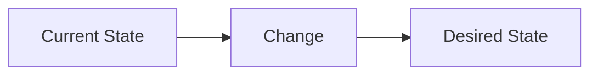

# Organization-Wide Standards

Every issue created or modified MUST comply with these standards.
Applies to ALL repositories in your target organization.

## Canonical Label Taxonomy

Use ONLY these labels (plus repo-specific `domain/` labels).
Legacy labels (`priority/p0`, `P0`, `priority:p0`, `type/bug`, `type:bug`, etc.) are deprecated.

**Priority** (exactly one required):
- `p0` — Critical: production broken or security vulnerability
- `p1` — Essential: foundation and fundamentals
- `p2` — Important: launch readiness
- `p3` — Nice to have: polish and innovation

**Type** (exactly one required):
- `bug` — Something isn't working
- `feature` — New capability or behavior
- `task` — Implementation work item
- `refactor` — Code improvement without behavior change
- `research` — Investigation or spike
- `epic` — Large multi-issue initiative

**Horizon** (exactly one required):
- `now` — Current sprint focus
- `next` — Next sprint candidate
- `later` — Backlog, not yet scheduled
- `blocked` — Waiting on external dependency

**Effort** (required):
- `effort/s` — Less than a day
- `effort/m` — 1-3 days
- `effort/l` — 3-5 days
- `effort/xl` — More than a week

**Source** (exactly one required for groom-created issues):
- `source/groom` — Created by /groom skill
- `source/user` — Reported by user observation
- `source/agent` — Created by AI agent

**Domain** (at least one, repo-specific):
- `domain/{name}` — e.g., `domain/api`, `domain/infra`, `domain/security`

## Issue Types (GitHub native)

Every issue MUST have an issue type set via GraphQL. Available types:
- **Bug** (node_id: `IT_kwDODnuAzs4Bxgbl`) — For bugs
- **Task** (node_id: `IT_kwDODnuAzs4Bxgbk`) — For tasks, refactors, research
- **Feature** (node_id: `IT_kwDODnuAzs4Bxgbm`) — For features

Set issue type after creation:
```bash
ORG=your-org
ISSUE_ID=$(gh api graphql -f query="{ repository(owner: \"$ORG\", name: \"REPO\") { issue(number: NUM) { id } } }" --jq '.data.repository.issue.id')
gh api graphql -f query="mutation { updateIssue(input: { id: \"$ISSUE_ID\", issueTypeId: \"TYPE_NODE_ID\" }) { issue { number issueType { name } } } }"
```

Map label type to issue type:
- `bug` label -> Bug issue type
- `feature` label -> Feature issue type
- `task`, `refactor`, `research`, `epic` labels -> Task issue type

## Milestones (REQUIRED)

Every issue MUST be assigned to a milestone. If the repo has no milestones:
1. Create a "Backlog" milestone (no due date)
2. Create milestone(s) for current work based on project.md focus

```bash
ORG=your-org
gh api "/repos/$ORG/REPO/milestones" --jq '.[].title'
gh api -X POST "/repos/$ORG/REPO/milestones" -f title="Backlog" -f description="Unscheduled work items"
gh issue edit NUM --milestone "Milestone Name"
```

Rules:
- `now` horizon -> current sprint/active milestone
- `next` horizon -> next milestone or "Backlog"
- `later` horizon -> "Backlog" or "Someday"
- `blocked` issues -> keep in their target milestone

## Org-Level Projects

Three org-level GitHub Projects. Link issues as appropriate:
- **Active Sprint** — Issues with `now` horizon
- **Product Roadmap** — All `p0`, `p1`, `p2` issues across repos
- **Triage Inbox** — New issues pending classification

```bash
ORG=your-org
gh project item-add PROJECT_NUMBER --owner "$ORG" --url "https://github.com/$ORG/REPO/issues/NUM"
```

## Label Migration

When auditing existing issues, migrate legacy labels:
```bash
gh issue edit NUM --remove-label "priority/p0" --add-label "p0"
gh issue edit NUM --remove-label "P0" --add-label "p0"
gh issue edit NUM --remove-label "type/bug" --add-label "bug"
gh issue edit NUM --add-label "later"  # if no horizon set
```

## Priority System

```
P0: CRITICAL — Production broken, security vulnerabilities
P1: FUNDAMENTALS — Testing, docs, quality gates, observability, working prototype
P2: LAUNCH READINESS — Landing page, onboarding, monetization, growth, marketing
P3: EVERYTHING ELSE — Innovation, polish, strategic improvements

Security mapping: Critical->P0, High->P1, Medium->P2, Low->P3
```

## Issue Format

Every issue must be **agent-executable in isolation** — an AI agent should be able to
pick up the issue and implement it without asking clarifying questions.

### Title

`[P{0-3}] Clear, actionable description`

### Labels (canonical)

- `p0|p1|p2|p3` (priority)
- `bug|feature|task|refactor|research|epic` (type)
- `now|next|later|blocked` (horizon)
- `effort/s|m|l|xl` (effort)
- `source/groom|source/user|source/agent` (source)
- `domain/{name}` (domain)

### Body Template

```markdown
## Problem
What's wrong or missing. Specific, with evidence.
Not "tests are lacking" — "no test coverage for payment webhook handler,
which processes $X/month and has failed silently twice."

## Context
- **Vision**: [one-liner from project.md]
- **Related**: #12, #34
- Domain knowledge agents need (conventions, constraints, prior art)

## Acceptance Criteria
- [ ] [test] Given [precondition], when [action], then [expected assertion in tests]
- [ ] [command] Given [precondition], when `[shell command]`, then [expected output]
- [ ] [behavioral] Given [precondition], when [user action], then [observable behavior]

## Affected Files
- `src/auth/session.ts` — add token refresh logic
- `src/auth/__tests__/session.test.ts` — add refresh tests

## Verification
```bash
pnpm test -- --grep "session"
pnpm typecheck
```

## Boundaries
- Do NOT modify [X]
- Do NOT change [Y]

## Approach
Recommended implementation direction. Code examples where helpful.
Reference existing patterns in the codebase.

## Overview


---
Created by `/groom`
```

### Section Guide

| Section | Purpose | When to omit |
|---------|---------|-------------|
| **Problem** | Ground truth — what's broken or missing | Never |
| **Context** | Orient the agent in the product and codebase | Never |
| **Acceptance Criteria** | Given/When/Then — directly translatable to tests | Never |
| **Affected Files** | Agent doesn't guess which files to touch | Never for code changes; omit for research |
| **Verification** | Executable proof the fix works | Never for code changes |
| **Boundaries** | Prevent scope creep | Omit when scope is naturally narrow |
| **Approach** | Recommended direction with code examples | Omit for research/investigation issues |
| **Overview** | Mermaid diagram of the change | Omit for chores, dependency bumps |

### Diagram Selection by Issue Type

| Type | Diagram |
|------|---------|
| Feature with user flow | `flowchart LR` (user journey) |
| Feature with branching logic | `flowchart TD` (decision tree) |
| Integration / API | `sequenceDiagram` |
| Refactor / debt | `graph TD` Before/After (two diagrams) |
| Bug | `sequenceDiagram` failure path + fix path |
| Data model change | `erDiagram` |
| Chore / dependency bump | Omit |

## Issue Readiness Scoring

Every issue gets a readiness score 0-100. Minimum score for agent execution: **70**.

| Section | Points | Scoring |
|---------|--------|---------|
| **Acceptance Criteria** | 25 | 25: Tagged Given/When/Then (`[test]`/`[command]`/`[behavioral]`) with 2+ criteria. 20: Given/When/Then without tags. 15: checkboxes without Given/When/Then. 5: vague "should work." 0: missing. |
| **Problem** | 20 | 20: specific with evidence. 10: clear but no evidence. 0: vague or missing. |
| **Affected Files** | 15 | 15: specific paths with descriptions. 8: paths without descriptions. 0: missing. |
| **Verification** | 15 | 15: executable commands. 8: described but not executable. 0: missing. |
| **Labels** | 10 | 2 per required label (priority, type, horizon, effort, domain). |
| **Effort** | 5 | 5: effort label present. 0: missing. |
| **Diagram** | 5 | 5: appropriate diagram present. 3: diagram present but wrong type. 0: missing (unless exempt). |
| **Milestone** | 5 | 5: assigned. 0: missing. |

### Score Interpretation

| Score | Status | Action |
|-------|--------|--------|
| 90-100 | Excellent | Ready for agent execution |
| 70-89 | Good | Ready for execution, minor gaps acceptable |
| 50-69 | Needs work | Run `/issue enrich` before execution |
| 0-49 | Incomplete | Requires human input or major enrichment |

### Error vs Warning Classification

**Errors** (block execution):
- Missing priority label
- Missing acceptance criteria
- No problem statement
- Missing affected files (for code change issues)

**Warnings** (flag but don't block):
- No diagram (unless exempt type)
- No effort label
- No verification commands
- No boundaries section
- Missing milestone

## Issue Creation Checklist

After creating each issue, verify:
- [ ] Readiness score >= 70 (`/issue lint`)
- [ ] Exactly one priority label (p0/p1/p2/p3)
- [ ] Exactly one type label (bug/feature/task/refactor/research/epic)
- [ ] Exactly one horizon label (now/next/later/blocked)
- [ ] At least one domain label (domain/*)
- [ ] Effort label (effort/s|m|l|xl)
- [ ] Source label (source/groom, source/user, or source/agent)
- [ ] Issue type set via GraphQL (Bug/Task/Feature)
- [ ] Assigned to a milestone
- [ ] P0/P1 with `now` horizon added to Active Sprint project
- [ ] Acceptance criteria in tagged Given/When/Then format (`[test]`/`[command]`/`[behavioral]`)
- [ ] Affected files listed with descriptions
- [ ] Verification commands are executable

## Acceptance Criteria Examples

### Tags

Every AC must be tagged for machine verification by `verify-ac`:

| Tag | Verified By | Use When |
|-----|-------------|----------|
| `[test]` | Grep test files for matching assertions | Behavior expressible as a unit/integration test |
| `[command]` | Execute shell command, check exit code + output | Behavior verifiable by running a command |
| `[behavioral]` | LLM traces code path (least reliable) | UX flows, cross-cutting behavior, no single test |

### Good (tagged, specific, Given/When/Then)
```markdown
- [ ] [test] Given a user with an expired session token, when they make an API request, then they receive a 401 with `{"error": "token_expired"}`
- [ ] [test] Given a user with an expired session token, when they visit any page, then the token is silently refreshed and the page loads normally
- [ ] [command] Given the auth module is deployed, when `curl -s -o /dev/null -w '%{http_code}' localhost:3000/api/health`, then output is `200`
- [ ] [behavioral] Given token refresh fails 3 times, when the user's next request arrives, then they are redirected to /login with a flash message
```

### Bad (untagged, vague, no structure)
```markdown
- [ ] Session refresh should work
- [ ] Handle edge cases
- [ ] Tests pass
```
