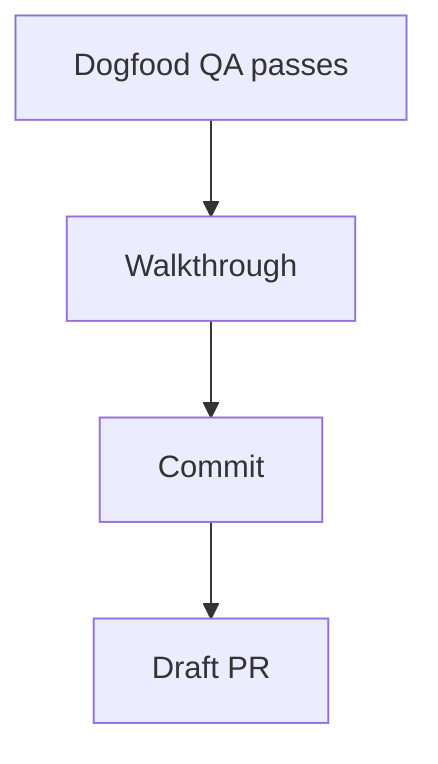
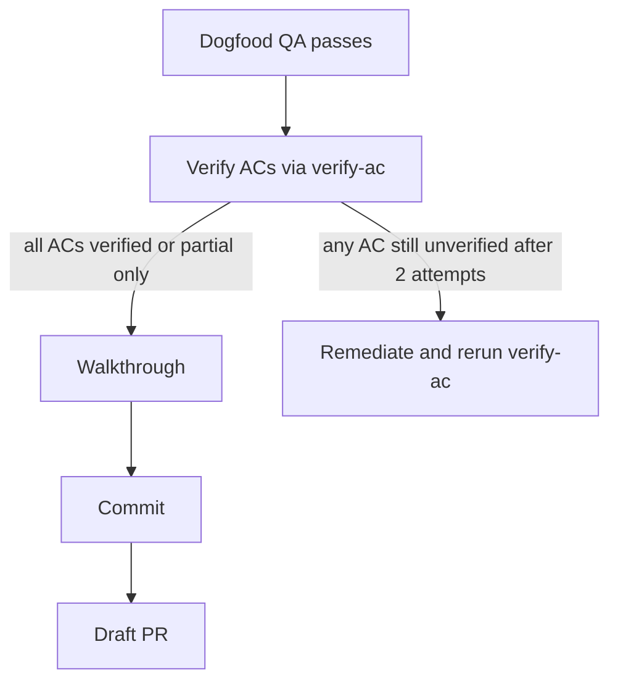
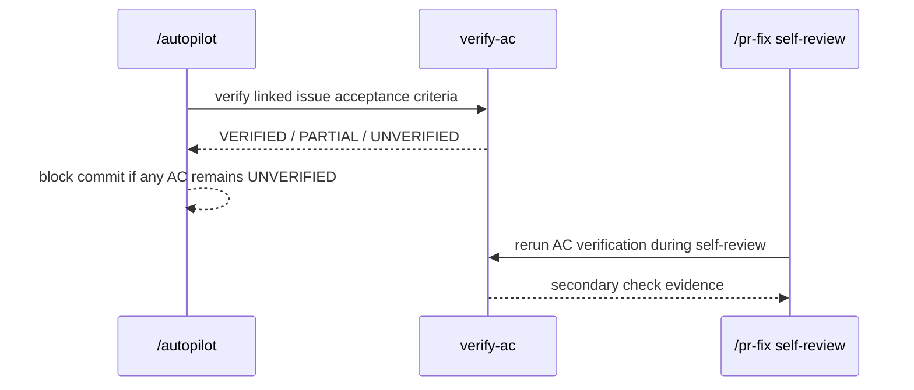

# Walkthrough — Issue #5

## Merge Claim

`/autopilot` now treats acceptance-criteria verification as a hard gate before commit, and `/pr-fix` now re-checks linked issue acceptance criteria during self-review.

## Why Now

Before this branch, the delivery lane could copy issue acceptance criteria into a PR body without ever verifying that the implementation still satisfied them. The `verify-ac` skill existed, but the pipeline did not require it.

## Before

Evidence:
- `grep -n 'Dogfood\\|verify-ac\\|Commit' core/autopilot/SKILL.md` showed no `verify-ac` gate between dogfood and commit.
- `grep -n 'verify-ac' core/pr-fix/SKILL.md core/pr-fix/references/workflow.md` returned no matches.

## What Changed

## After

Evidence:
- `grep -n 'Dogfood\\|Verify ACs\\|verify-ac\\|Commit' core/autopilot/SKILL.md`
- `grep -n 'verify-ac\\|Acceptance Criteria\\|self-review complete' core/pr-fix/SKILL.md core/pr-fix/references/workflow.md`
- `python3 core/skill-creator/scripts/quick_validate.py core/autopilot`
- `python3 core/skill-creator/scripts/quick_validate.py core/pr-fix`

## Persistent Verification

- `grep -n 'Dogfood\\|Verify ACs\\|verify-ac\\|Commit' core/autopilot/SKILL.md`
- `python3 core/skill-creator/scripts/quick_validate.py core/autopilot`
- `python3 core/skill-creator/scripts/quick_validate.py core/pr-fix`

## Residual Risk

This branch updates workflow contracts, not executable orchestration code. The protection is therefore documentation- and structure-level, not runtime-enforced automation.
