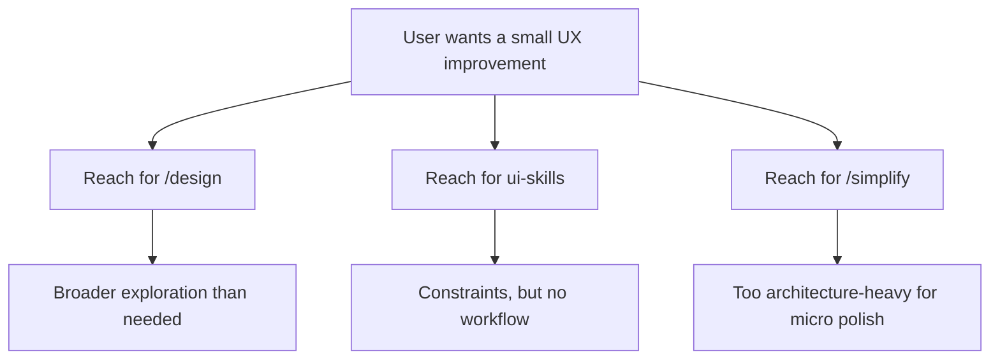
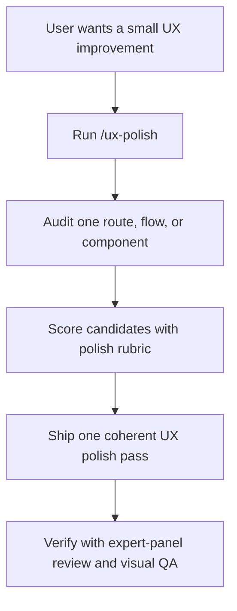
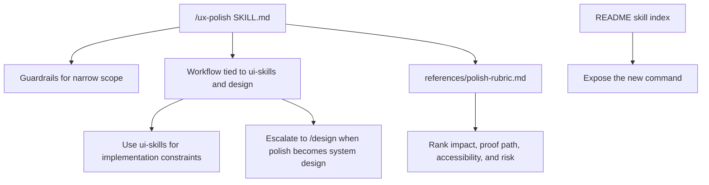

# Walkthrough — ux-polish skill

## Merge Claim

`/ux-polish` now gives the repo a dedicated workflow for small, meaningful UX improvements, sitting between broad design work and large simplification work.

## Why Now

Before this branch, the closest fits were `/design`, `ui-skills`, and `/simplify`. Those covered system design, passive UI constraints, and large refactors, but there was no explicit lane for "find one narrow UX friction point and ship the fix."

## Before

Evidence:
- `rg -n "ux-polish|small UX|micro polish" README.md core` returned no existing workflow skill.
- `core/design/SKILL.md` focuses on exploration, audit, tokens, and system-level implementation.
- `core/ui-skills/SKILL.md` provides constraints, not a scoped polish workflow.
- `core/simplify/SKILL.md` targets one high-leverage architectural refactor per PR.

## What Changed

## After

Evidence:
- `core/ux-polish/SKILL.md`
- `core/ux-polish/references/polish-rubric.md`
- `README.md`
- `python3 core/skill-builder/scripts/validate_skill.py core/ux-polish`
- `python3 core/skill-creator/scripts/package_skill.py core/ux-polish /tmp/spellbook-packages`
- `./scripts/sync.sh all`

## Persistent Verification

- `python3 core/skill-builder/scripts/validate_skill.py core/ux-polish`
- `python3 core/skill-creator/scripts/package_skill.py core/ux-polish /tmp/spellbook-packages`

## Residual Risk

This branch adds documentation-driven workflow guidance, not executable product code. The risk is mainly overlap with adjacent skills, which is mitigated by the explicit "out of scope" section and the handoff rules to `ui-skills`, `/design`, and `/simplify`.
