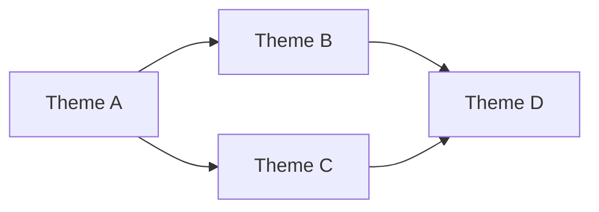

# /groom

Orchestrate interactive backlog grooming. Explore the product landscape with the user,
research current best practices, validate with multi-model consensus, then synthesize
into prioritized, agent-executable issues.

## Philosophy

**Exploration before synthesis.** Understand deeply, discuss with user, THEN create issues.

**Research-first.** Every theme gets web research, cross-repo investigation, and codebase
deep-dive before scoping decisions are made.

**Multi-model validation.** Strategic directions pass through `/thinktank` before locking.

**Quality gate on output.** Every created issue must score >= 70 on `/issue lint`.

**Orchestrator pattern.** /groom invokes skills and agents, doesn't reimplement logic.

**Opinionated recommendations.** Don't just present options. Recommend and justify.

**Intent-first backlog.** Every issue must carry a clear Intent Contract that downstream
build/PR workflows can reference.

## Org-Wide Standards

All issues MUST comply with `groom/references/org-standards.md`.
Load that file before creating any issues.

## Process

### Phase 1: Context

#### Step 1: Load or Update Project Context

Check for `project.md` in project root:

**If project.md exists:**
1. Read and display current vision/focus
2. Ask: "Is this still accurate? Any updates?"
3. If updates, rewrite project.md

**If project.md doesn't exist (but vision.md does):**
1. Read vision.md
2. Migrate content into project.md format (see `groom/references/project-md-format.md`)
3. Interview for missing sections (domain glossary, quality bar, patterns)
4. Write project.md, delete vision.md

**If neither exists:**
1. Interview: "What's your vision for this product? Where should it go?"
2. Write `project.md` using format from `groom/references/project-md-format.md`

Store as `{project_context}` for agent context throughout session.

#### Step 2: Check Tune-Repo Freshness

Verify that codebase context artifacts are current:

```bash
# CODEBASE_MAP.md — is last_mapped within 2 weeks?
[ -f docs/CODEBASE_MAP.md ] && head -5 docs/CODEBASE_MAP.md || echo "No CODEBASE_MAP.md"

# .glance.md files — do they exist for key directories?
find . -name ".glance.md" -maxdepth 3 2>/dev/null | wc -l

# CLAUDE.md and AGENTS.md — do they exist with essential sections?
[ -f CLAUDE.md ] && echo "CLAUDE.md exists" || echo "No CLAUDE.md"
[ -f AGENTS.md ] && echo "AGENTS.md exists" || echo "No AGENTS.md"
```

If stale or missing, recommend: "Consider running `/tune-repo` to refresh codebase
context before or after this grooming session."

Don't block grooming — flag and continue.

#### Step 3: Read Implementation Retrospective

```bash
[ -f .groom/retro.md ] && cat .groom/retro.md || echo "No retro data yet"
```

Extract patterns for this session:
- Effort calibration (historical predicted vs actual)
- Scope patterns (what commonly gets added during implementation)
- Blocker patterns (what commonly blocks progress)
- Domain insights (domain-specific gotchas)

Present: "From past implementations, I see these patterns: [summary]"

#### Step 4: Capture What's On Your Mind

Before structured analysis:

```
Anything on your mind? Bugs, UX friction, missing features, nitpicks?
These become issues alongside the automated findings.

(Skip if nothing comes to mind)
```

For each item: clarify if needed (one follow-up max), assign tentative priority.
Don't create issues yet — collect for Phase 5.

#### Step 5: Quick Backlog Audit

Invoke `/backlog` for a health dashboard of existing issues.

Present: "Here's where we stand: X open issues, Y ready for execution, Z need enrichment."

### Phase 2: Discovery

Launch agents in parallel:

| Agent | Focus |
|-------|-------|
| Product strategist | Gaps vs vision, user value opportunities |
| Technical archaeologist | Code health, architectural debt, improvement patterns |
| Domain auditors | `/audit --all` (replaces individual check-* invocations) |
| Growth analyst | Acquisition, activation, retention opportunities |

Synthesize findings into **3-5 strategic themes** with evidence.
Examples: "reliability foundation," "onboarding redesign," "API expansion."

Present a Mermaid `graph LR` showing how themes relate (dependencies, shared
components, compounding effects):



Present: "Here are the themes I see across the analysis — and how they relate. Which interest you?"

### Phase 3: Research (NEW)

For each theme the user wants to explore, before making scoping decisions:

#### Sub-Agent Research

1. **Web research agents** — Spawn Explore/general-purpose agents to:
   - Research current best practices and documentation for relevant technologies
   - Find how other projects solve similar problems
   - Check for updated library versions, deprecations, new approaches
   - Use Gemini for web-grounded research where available

2. **Cross-repo investigation** — Spawn agents to check other repos:
   - `gh api user/orgs --jq '.[].login'` to detect org, then `gh repo list <org> --limit 20 --json name,url`
   - How did we solve this problem elsewhere?
   - Are there shared patterns or libraries to reuse?
   - Are there related issues in sibling repos?

3. **Codebase deep-dive** — Spawn Explore agents with specific prompts:
   - Trace execution paths through affected code
   - Map dependencies and blast radius
   - Identify existing utilities, helpers, and patterns to reuse
   - Check `.glance.md` files and `docs/CODEBASE_MAP.md` for architecture context

4. **Compile research brief** — Structured findings per theme:
   ```markdown
   ## Research Brief: {Theme}

   ### Best Practices
   - [finding with source]

   ### Prior Art (Our Repos)
   - [repo]: [how they solved it]

   ### Codebase Context
   - Affected modules: [list]
   - Existing patterns to follow: [list]
   - Blast radius: [assessment]

   ### Recommendations
   - [grounded recommendation]
   ```

#### Sub-Agent Prompt Requirements

All sub-agent prompts during grooming must include:
- **Project context** from `project.md` (vision, domain glossary)
- **Specific investigation questions** (not vague "look into X")
- **Output format requirements** (structured findings, not prose)
- **Scope boundaries** (what to investigate, what to skip)

### Phase 4: Exploration Loop

For each theme the user wants to explore:

1. **Pitch** — Present research brief + 3-5 competing approaches with tradeoffs
2. **Present** — Recommend one approach, explain why
3. **Discuss** — User steers: "What about X?" "I prefer Y because Z"
4. **Validate** — Before locking any direction, invoke `/thinktank`:
   - Proposed approach + alternatives
   - Research findings from Phase 3
   - Relevant code context
   - Questions: "What are we missing?", "What will break?", "What's simpler?"
5. **Decide** — User locks direction informed by research + multi-model validation

Repeats per theme. Revisits allowed. Continues until user says "lock it in."

Use AskUserQuestion for structured decisions. Plain conversation for exploration.

**Team-Accelerated Exploration** (for large sessions):

| Teammate | Focus |
|----------|-------|
| Infra & quality | Production, quality gates, observability |
| Product & growth | Landing, onboarding, virality, strategy |
| Payments & integrations | Stripe, Bitcoin, Lightning |
| AI enrichment | Gemini research, Codex implementation recs |

### Phase 5: Synthesis

Once directions are locked for explored themes:

#### Step 1: Create Issues

Create atomic, implementable GitHub issues from agreed directions.
Include user observations from Phase 1 Step 4.

Use the new org-standards issue format with ALL sections:
- Problem (specific with evidence)
- Context (vision one-liner, related issues, domain knowledge)
- Intent Contract (problem statement, success conditions, hard boundaries, non-goals)
- Acceptance Criteria (tagged Given/When/Then: `[test]`, `[command]`, `[behavioral]`)
- Affected Files (specific paths with descriptions)
- Verification (executable commands)
- Boundaries (what NOT to do)
- Approach (recommended direction with code examples)
- Overview (Mermaid diagram per issue type)

For domain-specific findings from `/audit --all`:
Use `/audit {domain} --issues` to create issues from audit findings.

For strategic issues from exploration: create directly with full context.

#### Step 2: Quality Gate

Run `/issue lint` on every created issue.

- Score >= 70: pass
- Score 50-69: run `/issue enrich` to fill gaps
- Score < 50: rewrite manually (too incomplete for enrichment)

**No issue ships below 70.**

#### Step 3: Organize

Apply org-wide standards (load `groom/references/org-standards.md`):
- Canonical labels (priority, type, horizon, effort, source, domain)
- Issue types via GraphQL
- Milestone assignment
- Project linking (Active Sprint, Product Roadmap)

Close stale issues identified in Phase 1 Step 5 (with user confirmation).
Migrate legacy labels.

#### Step 4: Deduplicate

Three sources of duplicates:
1. User observations that overlap with automated findings
2. New issues from `/audit --issues` that overlap with each other
3. New issues that overlap with existing kept issues

Keep the most comprehensive. Close others with link to canonical.

#### Step 5: Summarize

```
GROOM SUMMARY
=============

Themes Explored: [list]
Directions Locked: [list]

Issues by Priority:
- P0 (Critical): N
- P1 (Essential): N
- P2 (Important): N
- P3 (Nice to Have): N

Readiness Scores:
- Excellent (90-100): N
- Good (70-89): N
- All issues scored >= 70 ✓

Recommended Execution Order:
1. [P0] ...
2. [P1] ...

Ready for /autopilot: [issue numbers]
View all: gh issue list --state open
```

### Phase 6: Plan Artifact

Save the grooming plan as a reviewable artifact:

```bash
mkdir -p .groom
```

Write `.groom/plan-{date}.md`:
```markdown
# Grooming Plan — {date}

## Themes Explored
- [theme]: [direction locked]

## Issues Created
- #N: [title] (score: X/100)

## Deferred
- [topic]: [why deferred, when to revisit]

## Research Findings
[Key findings from Phase 3 worth preserving]

## Retro Patterns Applied
[How past implementation feedback influenced this session's scoping]
```

This enables:
- `groom apply` to resume after review
- Future sessions to reference what was explored and deferred
- Retro patterns to accumulate across sessions

## Modes

### Interactive (default)
Full grooming session with exploration, research, and synthesis. Phases 1-6 above.

### Health Dashboard (`/groom --health`)
Quick read-only backlog assessment. Runs Phase 1 Step 5 only.
See `references/backlog-health.md` for the full dashboard procedure.

### Tidy (`/groom --tidy`)
Non-interactive automated cleanup. Lints, enriches, deduplicates, closes stale, migrates labels.
See `references/tidy-procedure.md` for the full procedure.

## Related Skills

### Plumbing (Phase 2 + 5)
- `/audit [domain|--all]` — Unified domain auditor
- `/issue lint` — Score issues against org-standards
- `/issue enrich` — Fill gaps with sub-agent research
- `/issue decompose` — Split oversized issues
- `/retro` — Implementation feedback capture

### Planning & Design
| I want to... | Skill |
|--------------|-------|
| Full planning for one idea | `/shape` |
| Multi-model validation | `/thinktank` |

### Standalone Domain Work
```bash
/audit quality        # Audit only
/audit quality --fix  # Audit + fix
/triage              # Fix highest priority production issue
```

## Visual Deliverable

After completing the core workflow, generate a visual HTML summary:

1. Read `~/.claude/skills/visualize/prompts/groom-dashboard.md`
2. Read the template(s) referenced in the prompt
3. Read `~/.claude/skills/visualize/references/css-patterns.md`
4. Generate self-contained HTML capturing this session's output
5. Write to `~/.agent/diagrams/groom-{repo}-{date}.html`
6. Open in browser: `open ~/.agent/diagrams/groom-{repo}-{date}.html`
7. Tell the user the file path

Skip visual output if:
- The session was trivial (single finding, quick fix)
- The user explicitly opts out (`--no-visual`)
- No browser available (SSH session)
