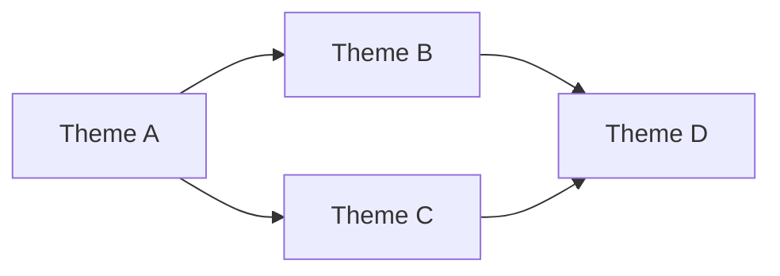

# Interactive Workflow

Use this reference for the full interactive `/groom` flow through context,
discovery, research, and exploration.

## Phase 1: Context

### Step 1: Load or Update Project Context

Check for `project.md` in project root:

**If `project.md` exists:**
1. Read and display current vision/focus
2. Ask: "Is this still accurate? Any updates?"
3. If updates, rewrite `project.md`

**If `project.md` doesn't exist (but `vision.md` does):**
1. Read `vision.md`
2. Migrate content into `project.md` format (see `project-md-format.md`)
3. Interview for missing sections (domain glossary, quality bar, patterns)
4. Write `project.md`, delete `vision.md`

**If neither exists:**
1. Interview: "What's your vision for this product? Where should it go?"
2. Write `project.md` using `project-md-format.md`

Store as `{project_context}` for agent context throughout session.

### Step 2: Check Tune-Repo Freshness

Verify that codebase context artifacts are current:

```bash
[ -f docs/CODEBASE_MAP.md ] && head -5 docs/CODEBASE_MAP.md || echo "No CODEBASE_MAP.md"
[ -f docs/context/INDEX.md ] && echo "Context index exists" || echo "No context index"
[ -f docs/context/ROUTING.md ] && echo "Routing table exists" || echo "No routing table"
[ -f docs/context/DRIFT-WATCHLIST.md ] && echo "Drift watchlist exists" || echo "No drift watchlist"
[ -f CLAUDE.md ] && echo "CLAUDE.md exists" || echo "No CLAUDE.md"
[ -f AGENTS.md ] && echo "AGENTS.md exists" || echo "No AGENTS.md"
```

If stale or missing, recommend `/tune-repo`. Do not block grooming.

### Step 3: Read Implementation Retrospective

```bash
find .groom/retro -type f -name '*.md' -print -exec cat {} \; 2>/dev/null || echo "No retro data yet"
```

Extract:
- effort calibration
- scope patterns
- blocker patterns
- domain gotchas

Present: "From past implementations, I see these patterns: [summary]"

### Step 4: Capture What's On Your Mind

Ask:

```text
Anything on your mind? Bugs, UX friction, missing features, nitpicks?
These become issues alongside the automated findings.

(Skip if nothing comes to mind)
```

For each item: clarify once if needed, assign tentative priority, do not create yet.

### Step 5: Quick Backlog Audit

Invoke `/backlog` for a health dashboard.

Present: "Here's where we stand: X open issues, Y ready for execution, Z need enrichment."

Also evaluate backlog budget:
- Is the open issue count still legible?
- Do issues cluster around a few strategic themes?
- Is there duplicate/refactor/screenshot-only noise?
- Are there ideas better kept in docs/notes than as open issues?

If the backlog sprawls, declare:
`This is now a reduction session. Default action is keep/merge/defer/close, not add.`

## Phase 2: Discovery

Launch parallel discovery lanes:

| Agent | Focus |
|-------|-------|
| Product strategist | gaps vs vision, user value opportunities |
| Technical archaeologist | code health, architectural debt, improvement patterns |
| Domain auditors | `/audit --all` |
| Growth analyst | acquisition, activation, retention opportunities |

Synthesize findings into 3-5 strategic themes with evidence.

Present a Mermaid dependency map:



Then ask which themes to explore.

## Phase 3: Research

For each theme the user wants to explore, do research before scoping.

### Research lanes

1. **Web research**
   - best practices
   - current docs
   - deprecations
   - updated approaches
   - use Gemini when helpful
2. **Cross-repo investigation**
   - how sibling repos solved similar problems
   - shared patterns/libraries to reuse
   - related issues elsewhere
3. **Codebase deep-dive**
   - trace execution paths
   - map dependencies and blast radius
   - identify patterns/utilities to reuse
   - check codebase context artifacts when present
4. **Compile a research brief**

Use this output shape:

```markdown
## Research Brief: {Theme}

### Best Practices
- [finding with source]

### Prior Art (Our Repos)
- [repo]: [how they solved it]

### Codebase Context
- Affected modules: [list]
- Existing patterns to follow: [list]
- Blast radius: [assessment]

### Recommendations
- [grounded recommendation]
```

### Sub-agent prompt requirements

All sub-agent prompts during grooming must include:
- project context from `project.md`
- specific investigation questions
- output format requirements
- scope boundaries

## Phase 4: Exploration Loop

For each selected theme:

1. Pitch research brief plus 3-5 plausible approaches
2. Recommend one approach and explain why
3. Discuss with the user
4. Validate with `/research thinktank` before locking direction
5. Decide and record the direction

Use plain conversation by default. Structured questions only when a real decision needs it.

### Team-accelerated exploration

| Teammate | Focus |
|----------|-------|
| Infra & quality | production, quality gates, observability |
| Product & growth | landing, onboarding, virality, strategy |
| Payments & integrations | Stripe, Bitcoin, Lightning |
| AI enrichment | Gemini research, Codex implementation recs |
