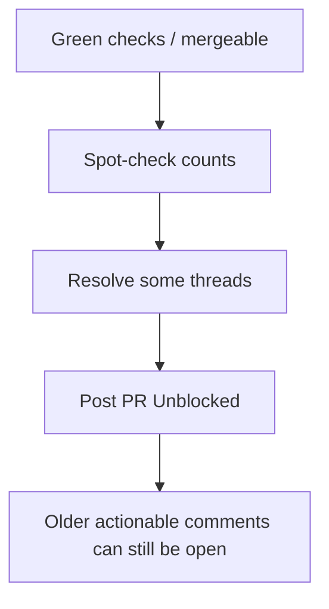
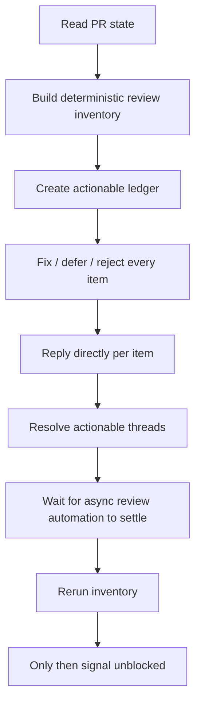
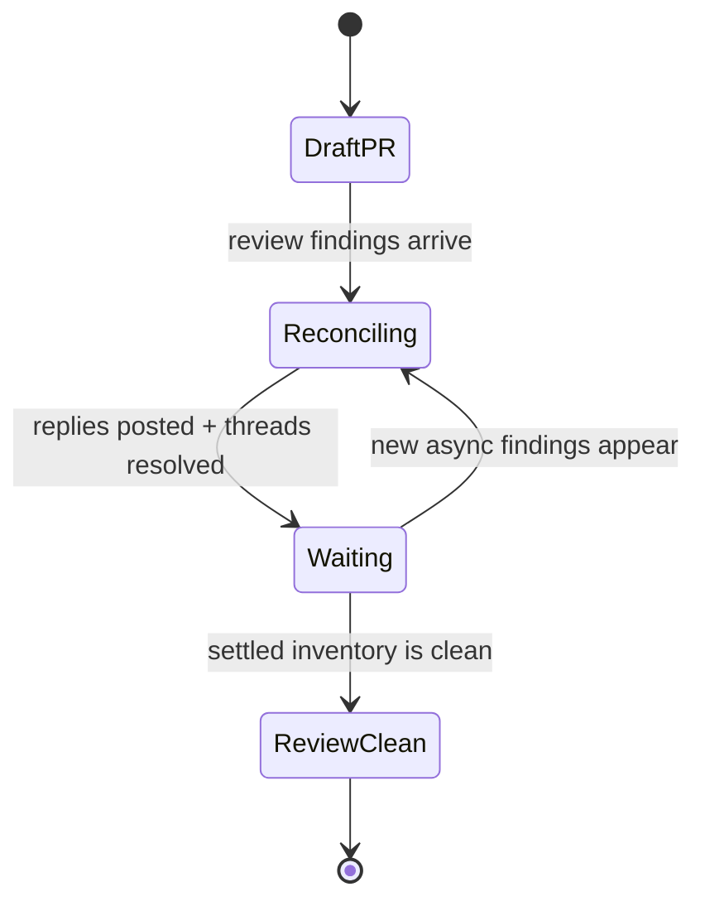

# PR Walkthrough: Review Reconciliation Redesign

## Claim

This branch closes the false-"PR Unblocked" gap by making `pr-fix` inventory-driven, settlement-gated, and explicit about handoff boundaries in `pr` and `autopilot`.

## Renderer

Diagram-led walkthrough with proof commands.

## Why Now

The old `pr-fix` shape let a PR look clean while old actionable review comments were still unresolved. That is a real workflow failure, not wording polish.

## Before



The failure mode was count-driven reconciliation. A temporary clean-looking surface could mask unresolved older review items.

## What Changed



The redesign moved the critical rule into the skill contract:
- inventory beats counts
- reply per actionable item
- rerun inventory after async reviewers settle
- `pr` and `autopilot` cannot imply review-clean status without `/pr-fix`

## After



The important change is not just "do more review." It is "do not signal success until the live PR inventory stays closed after settlement."

## Evidence

### Structural validation

```bash
python3 core/skill-builder/scripts/validate_skill.py core/pr-fix
python3 core/skill-builder/scripts/validate_skill.py core/pr
python3 core/skill-builder/scripts/validate_skill.py core/autopilot
```

Observed result:
- `pr-fix`: valid, no warnings
- `pr`: valid, no warnings
- `autopilot`: valid, existing pre-branch warning about long body remains

### Live failure-mode probe

```bash
python3 core/pr-fix/scripts/review_inventory.py 533 --repo misty-step/bitterblossom
```

Observed result:
- unresolved threads: `6`
- top-level review comments: `19`
- bot issue comments: `4`
- checks: `21`

This is the key proof. The new inventory script exposes the exact missed state that previously slipped through.

## Persistent Verification

Current durable checks:
- `python3 core/skill-builder/scripts/validate_skill.py core/pr-fix`
- `python3 core/skill-builder/scripts/validate_skill.py core/pr`
- `python3 core/skill-builder/scripts/validate_skill.py core/autopilot`

These protect packaging and structural integrity of the skill changes.

## Residual Gap

There is still no fully automated regression harness that simulates delayed bot comments and proves the settlement gate behavior end-to-end. The branch improves the prompt contract and adds deterministic inventory tooling, but that live-review workflow is not yet mechanically tested.
