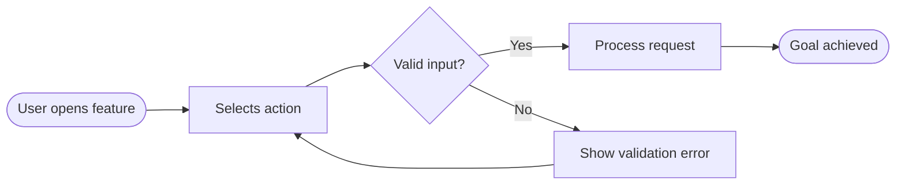
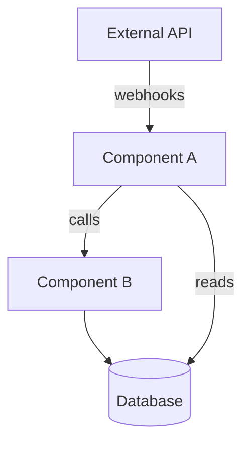
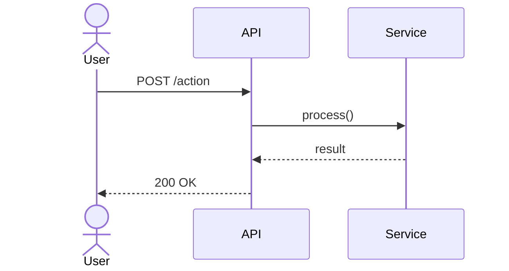
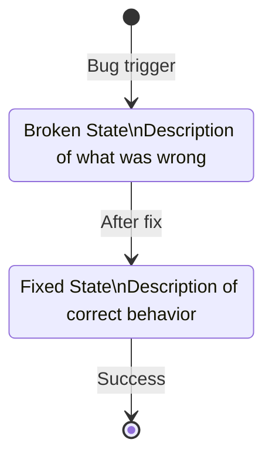
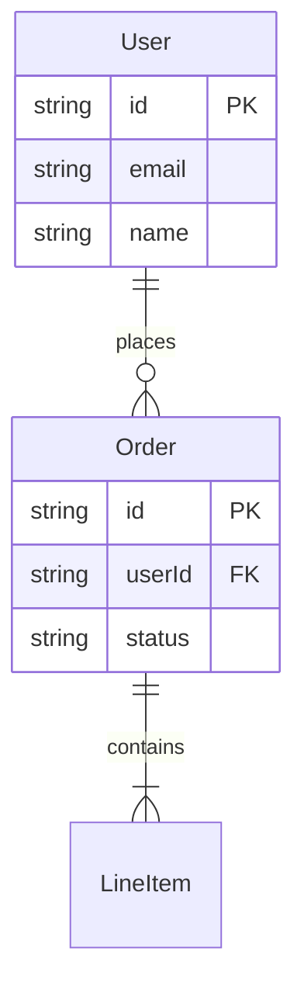
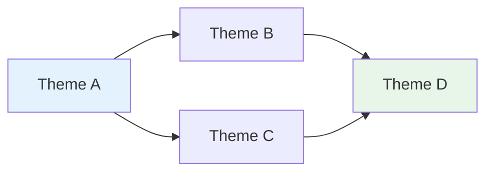

# GitHub Mermaid Patterns

GitHub renders Mermaid natively in issues, PRs, discussions, and markdown files. No upload, no render pipeline. Mermaid source is version-controlled and readable as text if rendering fails.

## Pattern Selection Guide

| Use Case | Diagram Type | When |
|----------|-------------|------|
| User journey / feature flow | `flowchart LR` | Spec: primary user flow |
| Component relationships | `graph TD` | Architect: new/changed components |
| Interaction sequence | `sequenceDiagram` | Architect: async calls, API interactions |
| State before/after | `stateDiagram-v2` | PR: bug fixes, behavior changes |
| Data model | `erDiagram` | Architect: schema changes |
| Theme/issue relationships | `graph LR` | Groom: theme synthesis |
| Decision tree | `flowchart TD` | Spec: approach selection logic |

## Decision Logic

**When to include a diagram:** If the change involves logic, relationships, data flow, or architecture — include one. If the change can be explained in one sentence with no branching or relationships → omit.

**Which type to pick:**
- Feature with user interaction → `flowchart LR`
- Feature with branching logic → `flowchart TD`
- Integration/API/async feature → `sequenceDiagram`
- New components → `graph TD`
- Schema changes → `erDiagram`
- Bug fix (broken → fixed) → `stateDiagram-v2`
- Refactor before/after → two `graph TD` blocks labeled Before/After
- Theme relationships → `graph LR`

## Annotated Examples

### flowchart LR — User Journey



- `([...])` = rounded terminal nodes (start/end)
- `{...}` = decision diamonds
- `[...]` = action rectangles
- `--` text `-->` = labeled edges

### graph TD — Component Relationships



- `-->|label|` = labeled directed edge
- `[(text)]` = cylinder (database/store)
- `subgraph Name` ... `end` = grouping

### sequenceDiagram — Async Interactions



- `actor Name` = stick figure for human actors
- `->>` = solid arrow (request)
- `-->>` = dashed arrow (response)
- `Note over A,B: text` = annotation spanning actors

### stateDiagram-v2 — Before/After State



### erDiagram — Data Model



- `||--o{` = one-to-many
- `||--|{` = one-to-one-or-many
- Fields: `type name PK/FK`

### graph LR — Theme Relationships



## GitHub Gotchas

**Avoid native Mermaid icon sets** — they render on the Mermaid playground but fail on GitHub. Stick to core node shapes and edge types.

**Dark/light theme**: GitHub switches between dark and light. Avoid hardcoded hex fills that only look good in one mode. If you use `style` directives, pick colors that work in both (or omit fills entirely).

**Node count**: Keep node count under 30 for readability. If a diagram needs more, split into multiple diagrams with a parent/child relationship.

**Labels**: Match terminology exactly to the surrounding prose. If the spec says "Payment Service", the diagram node should say `Payment Service`, not `PaySvc`.

**Subgraphs**: Useful for grouping, but GitHub renders them slightly differently than the Mermaid playground. Test with simple subgraphs before nesting.

**Line breaks in node labels**: Use `\n` inside node text for multi-line labels in most diagram types.

## Code Fence Format

Always use triple-backtick mermaid fences in GitHub markdown:

````markdown

````

Do NOT use HTML `<div class="mermaid">` — that's the old embed style and doesn't work in GitHub issues.

## Sizing Guidance

- **30 nodes max** — beyond this, comprehension drops fast
- **Label length** — keep node labels under 40 chars; abbreviate if needed
- **Edge labels** — 1-4 words; omit if the relationship is obvious from context
- **Diagrams per comment** — 1-2 max per comment; if more are needed, split into sections with headers
